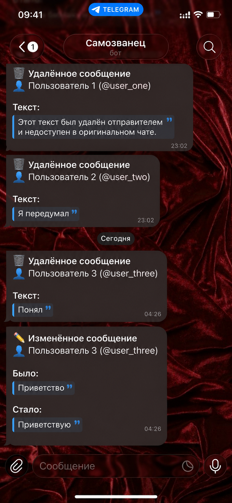

Telegram Anti-Delete & Edit Messages bot

Telegram-бот, который отслеживает **удалённые** и **отредактированные** сообщения в личных чатах через [Telegram Business API](https://core.telegram.org/bots/features#business-mode).

## 📸 Демонстрация работы
Ниже представлен пример того, как бот перехватывает удалённые сообщения от разных пользователей и наглядно фиксирует изменения текста в формате «Было / Стало»: 

<p align="center">
  
</p>

## Что умеет

- 🗑 **Удалённые сообщения** — если собеседник удалил сообщение, бот пришлёт вам его копию
- ✏️ **Отредактированные сообщения** — бот покажет, что было до и после правки

## Требования

- Python 3.10+
- [python-telegram-bot](https://github.com/python-telegram-bot/python-telegram-bot) v21+
- Telegram Bot Token (через [@BotFather](https://t.me/BotFather))
- **Включённый Secretary Mode (Режим секретаря)** в настройках бота у [@BotFather](https://t.me/BotFather). Без него Telegram не позволит привязать бота в меню автоматизации чатов.
- Подключение бота как Business Bot в настройках Telegram-аккаунта

## Установка

```bash
git clone [https://github.com/arianabagdasaryan02-pixel/tg-bot-anti-delete.git](https://github.com/arianabagdasaryan02-pixel/tg-bot-anti-delete.git)
cd tg-bot-anti-delete

python -m venv venv
source venv/bin/activate  # Windows: venv\Scripts\activate

pip install -r requirements.txt
```
## Настройка

1. Скопируйте пример конфига:

```bash
cp config.example.py config.py
```

2. Впишите токен бота в `config.py`:

```python
BOT_TOKEN = "123456:ABC-..."
BOT_USERNAME = "your_bot_username"  # ВАЖНО: указывайте имя бота строго БЕЗ символа @
```

3. Подключите бота к своему Telegram-аккаунту:
   - Перейдите в @BotFather -> /mybots -> выберите вашего бота -> Bot Settings -> Mode Settings.
   - Убедитесь, что тумблер Secretary Mode переведен в состояние ON (включен).
   - Откройте свой личный профиль в Telegram -> «Изменить» (Settings) -> «Автоматизация чатов» (Telegram Business).
   - Найдите и добавьте вашего бота

## Запуск

```bash
python bot.py
```

## Где запускать бота

> ⚠️ **Важно:** Telegram Business API не хранит очередь недоставленных событий. Если бот выключен в момент удаления сообщения — оно теряется навсегда. Для полноценной работы нужен постоянно запущенный бот (24/7).

Коротко о вариантах:

- **Свой компьютер** — подходит для теста и разработки. Бот работает только пока включён ПК
- **VPS** (Beget, Timeweb, Hetzner, ~150-500₽/мес) — работает 24/7, рекомендуется для постоянного использования
- **Бесплатные хостинги** (Bothost, Amvera) — проще в настройке, но есть лимиты по ресурсам
- **Raspberry Pi / домашний сервер** — если хочется автономности

📖 **Подробное руководство по каждому варианту с командами — в [DEPLOYMENT.md](DEPLOYMENT.md)**

## Структура проекта

```
.
├── bot.py              # Основной код бота
├── cleanup.py          # Очистка старых данных (для cron)
├── config.py           # Токен бота (не коммитить!)
├── config.example.py   # Пример конфига
├── requirements.txt    # Зависимости
├── messages.db         # SQLite база (создаётся автоматически)
└── media_archive/      # Сохранённые медиафайлы
```

## Автоочистка старых данных

В комплекте есть `cleanup.py` — удаляет записи и медиафайлы старше 7 дней. Настройте через cron:

```bash
crontab -e
```

Добавьте строку (каждый день в 03:00):

```
0 3 * * * cd /path/to/bot && /path/to/bot/venv/bin/python cleanup.py >> cleanup.log 2>&1
```

Количество дней хранения задаётся константой `DAYS_TO_KEEP` в начале `cleanup.py`.

## Как это работает

Бот использует [Telegram Business API](https://core.telegram.org/bots/features#business-mode), которое позволяет получать копии входящих сообщений в личных чатах подключённого аккаунта. При удалении или редактировании сообщения бот сравнивает его с сохранённой копией и отправляет уведомление владельцу.

Медиафайлы до 20 МБ скачиваются и хранятся локально. Для файлов большего размера сохраняется `file_id` и thumbnail — бот попытается отправить оригинал через Telegram API при удалении.

## Лицензия

[MIT](LICENSE)
